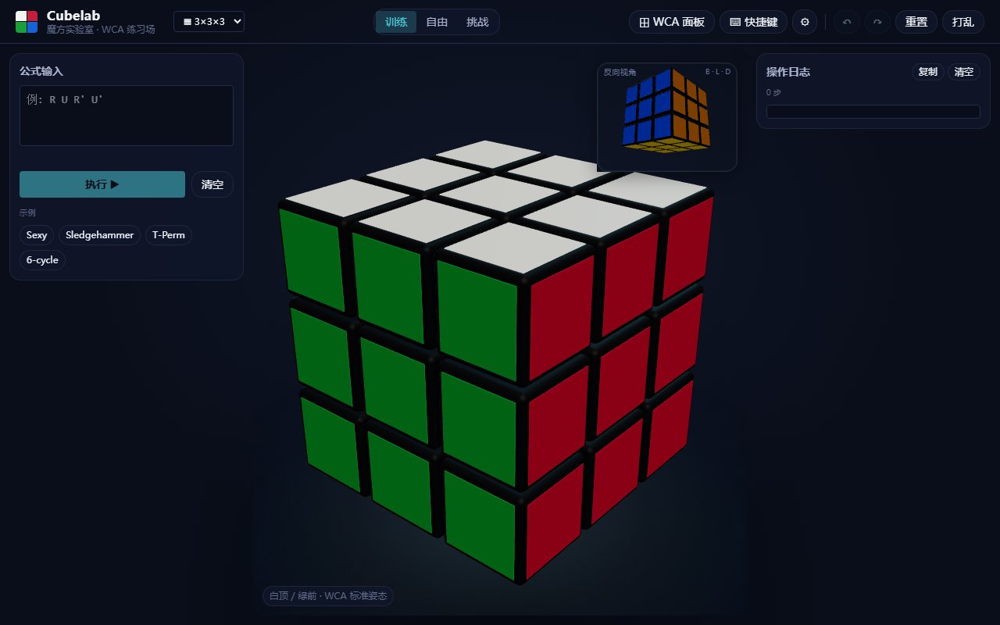

<div align="center">

# 🧊 Cubelab · 魔方实验室

**浏览器里的 WCA 记谱法练习场 · 速拧计时器 · 多阶魔方模拟器**

支持 2×2 ~ 7×7 全系列 NxN 立方体 · WCA 标准打乱 · CFOP / Roux / ZZ 友好键位 · 挑战模式含 15s 观察期 + Ao5/Ao12

[](https://github.com/nvrenshiren/mofang/actions/workflows/ci.yml)
[](https://vitejs.dev)
[](https://www.typescriptlang.org)
[](https://threejs.org)
[](https://tailwindcss.com)
[](#测试)
[](#许可)

**中文** · [English](./README.en.md)

</div>

<p align="center">
  
</p>

---

## ✨ 核心特性

- 🎲 **6 种 WCA 立方体**:2×2 / 3×3 / 4×4 / 5×5 / 6×6 / 7×7
- 🎨 **暗室专业风 3D 渲染**:Three.js r170 倒角 cubie + 凸起贴纸 + 聚光灯氛围 + 反向 PiP 辅助
- ⌨️ **每谜独立键位**:按 WCA 规则 + 解法风格分级(2×2 仅 R/U/F;奇数 N 含 M/E/S 中层)
- 📝 **WCA 公式解析**:支持 `R U R'`、`Rw`、`3Rw`、`(R U R' U')6`、行/块注释
- 🔀 **WCA 标准打乱**:N=2/3/4/5/6/7 各按官方规则,4x4+ 含宽层 `Rw` `3Rw`
- 🎯 **三种模式**
  - **训练**:基准锁定 + 全套辅助 UI
  - **自由**:可拖拽视角探索
  - **挑战**:模拟实战(15s 观察 → 自动计时 → 求解检测 → 本地最佳/Ao5/Ao12)
- 💾 **持久化**:挑战成绩、最近 100 局、用户偏好全部存 `localStorage`
- 🔊 **音效系统**:Web Audio API 合成的咔哒声 / 完成铃声 / 倒计时 tick
- 🧪 **可测试架构**:269 单元测试 + 12 端到端测试,domain 层零 DOM/Three 依赖

## 🚀 快速开始

```bash
# 依赖
npm install            # 需要 Node ≥ 20.19

# 开发
npm run dev            # → http://localhost:5173

# 构建
npm run build          # tsc 类型检查 + vite 生产打包

# 测试
npm test               # 269 个 vitest 单元测试
npm run test:watch     # 监听模式
npm run test:e2e       # 12 个 playwright 端到端测试
```

## 🎮 使用指南

### 三种模式

| 模式 | 视角 | UI 辅助 | 操作约束 |
|---|---|---|---|
| **训练 Training** | 锁定 WCA 标准 | 全部显示 | 自由 (撤销/重做/重置/打乱) |
| **自由 Free** | 鼠标拖拽 | 全部显示 | 同训练 |
| **挑战 Challenge** | 锁定 | 隐藏辅助 + 隐藏题目 | 仅"开始/重新开始",无撤销 |

### 键位(按谜题大小分级)

**共通**

| 键 | 作用 |
|---|---|
| `Shift + 键` | 反向 (prime, `'`) |
| `Alt + 键` | 180° (`2`) |
| `;` `[` `-` | 整体旋转 y / x / z |
| `Ctrl + Z` / `Ctrl + Shift + Z` | 撤销 / 重做(挑战模式禁用) |
| `Esc` | 重置魔方(挑战模式禁用) |
| `Space` | 训练/自由:打乱;挑战:开始/重新开始 |

**面键**

| 谜题 | 转动键 |
|---|---|
| **2×2** | `r` `u` `f`(Ortega/CLL/EG 三面足够) |
| **3×3 / 5×5 / 7×7**(奇数) | `r` `u` `f` `l` `d` `b` + `m` `e` `s`(M/E/S 中层) |
| **4×4 / 6×6**(偶数) | `r` `u` `f` `l` `d` `b`(偶数无 dead-middle,M/E/S 不绑) |

宽层 `Rw` / `3Rw` 通过 **WCA 按钮面板** 或公式输入触发(Shift/Alt 已被占用)。

### 公式输入示例

```
R U R' U'                          # Sexy move
(R U R' U')6                       # Sexy 重复 6 次 = 还原
R U R' U' R' F R2 U' R' U' R U R' F'   # T-Perm
Rw U2 Rw' U2 Rw U2 Rw'             # 4x4 中心交换 (含宽层)
3Rw U2 3Rw' U' 3Rw U2 3Rw' U      # 5x5 三层宽
```

支持 `//` 行注释、`/* */` 块注释、逗号分隔。

## 🧩 谜题与打乱矩阵

| N | cubie 数 | 用面 | 打乱深度 | 步数 (WCA) |
|---|---|---|---|---|
| 2×2 | 8 | R U F | 单层 | 11 |
| 3×3 | 26 | R L U D F B | 单层 | 20 |
| 4×4 | 56 | R L U D F B | 单层 + Rw | 45 |
| 5×5 | 98 | R L U D F B | 单层 + Rw | 60 |
| 6×6 | 152 | R L U D F B | 单层 + Rw + 3Rw | 80 |
| 7×7 | 218 | R L U D F B | 单层 + Rw + 3Rw | 100 |

打乱共通约束:相邻不同面 + 不连续 3 步同轴。

## 🏗 架构

### 目录结构

```
src/
├─ main.ts                         # 装配入口
├─ app.css                         # Tailwind 4 + 设计令牌 (@theme)
│
├─ domain/                         # 纯逻辑 (零 DOM/Three 依赖, 全单元测试覆盖)
│  ├─ puzzles/
│  │  ├─ Puzzle.ts                 # Puzzle<S, M> 接口
│  │  ├─ registry.ts               # 谜题工厂注册表
│  │  └─ nxn/                      # NxN 立方体 (一份代码覆盖 6 个 N)
│  │     ├─ NxNState.ts            # 26~218 cubie 的位置 + 朝向
│  │     ├─ NxNMoves.ts            # R/L/U/D/F/B + M/E/S + 宽层 + x/y/z
│  │     ├─ NxNParser.ts           # WCA 公式解析 (分组/注释/wide 前缀)
│  │     ├─ NxNScramble.ts         # 按 N 分级的 WCA 打乱
│  │     └─ NxNCube.ts             # 装配 Puzzle 实现
│  ├─ history/HistoryStack.ts      # 撤销/重做栈
│  ├─ math/{Mat3,Vec3}.ts          # 整数矩阵代数
│
├─ render/                         # Three.js 渲染层
│  ├─ Stage.ts                     # 场景/相机/灯光/双视口
│  ├─ CubieMesh.ts                 # 倒角 cubie 工厂
│  ├─ FreeOrbit.ts                 # 自由模式相机拖拽
│  └─ puzzles/NxNCubeRenderer.ts   # 单 renderer 适配 N=2..7
│
├─ input/
│  ├─ ActionBus.ts                 # 中心事件总线
│  └─ Keyboard.ts                  # 键盘 → Action (Puzzle-aware keymap)
│
├─ store/
│  ├─ AppStore.ts                  # 编排 puzzle + renderer + history
│  └─ persistence.ts               # 用户偏好持久化
│
├─ challenge/                      # 挑战模式特性
│  ├─ ChallengeController.ts       # 状态机 + 计时器叠层
│  └─ Times.ts                     # 成绩持久化 + Ao5/Ao12 计算
│
├─ audio/Sfx.ts                    # Web Audio 合成音效
│
└─ ui/                             # DOM 组件 (vanilla TS, 无框架)
   ├─ TopBar.ts                    # 顶栏 + 模式切换 + puzzle 下拉
   ├─ WcaPanel.ts                  # WCA 按钮浮窗
   ├─ FormulaInput.ts              # 公式输入 + 实时校验
   ├─ LogPanel.ts                  # 用户操作日志
   ├─ ScramblePanel.ts             # 当前打乱题目
   ├─ TimesPanel.ts                # 挑战成绩 (Best/Ao5/Ao12)
   ├─ SettingsPanel.ts             # 设置浮窗
   └─ MiniBackView.ts              # 反向相机 PiP 辅助
```

### 数据流

```
键盘 / WCA 按钮 / 公式 / 程序           顶栏下拉
        │                                  │
        ▼                                  ▼
   ActionBus.dispatch({type:'move', ...})  ActionBus({type:'puzzle-change'})
        │                                  │
        ▼                                  ▼
                AppStore
        ├── 当前 Puzzle 实例
        ├── 当前 Renderer 实例
        ├── HistoryStack (撤销栈)
        ├── currentScramble[] (打乱题目, 不入历史)
        └── mode (training/free/challenge)
                │
        ┌───────┼───────┬─────────────┐
        ▼       ▼       ▼             ▼
    Renderer  History  Scramble    Mode toggles
    动画队列   栈更新    面板        显示/隐藏 UI
        │
        ▼
    onMoveApplied → ChallengeController.notifyMoveApplied
                        └─ 检测 isSolved → 停表 → 入 TimesStore
```

### 核心抽象

```ts
interface Puzzle<State, Move> {
  meta: PuzzleMeta
  solved(): State
  apply(s: State, m: Move): State
  isSolved(s: State): boolean
  inverseMove(m: Move): Move
  parse(src: string): Move[]
  safeParse(src: string): { ok: true; moves: Move[] } | { ok: false; error: string; index: number }
  format(m: Move): string
  formatMoves(moves: readonly Move[]): string
  generateScramble(opts?: { length?: number; seed?: number }): Move[]
  buttonGroups(): readonly ButtonGroup[]    // WCA 按钮面板内容
  keymap(): readonly KeyBinding<Move>[]     // 键盘绑定
}

interface PuzzleRenderer<State, Move> {
  mount(stage: Stage, initialState: State): void
  unmount(): void
  syncToState(state: State): void
  enqueueMove(move: Move, durationMs: number): Promise<void>
  clearQueue(): void
  isBusy(): boolean
  onMoveApplied?: (move: Move) => void
}
```

任何新谜题只需实现这两个接口并注册到 `PUZZLES`,UI / 输入 / 历史栈 / 计时全部自动适配。

## 🧪 测试

```bash
npm test          # 单元 (vitest)
npm run test:e2e  # 端到端 (playwright)
```

| 类别 | 数量 | 覆盖 |
|---|---|---|
| Mat3 / Vec3 数学 | 7 | 整数矩阵代数 |
| NxN 转动 + 周期 + Sexy + T-Perm + 中层 | 87 | 6 个 N × 多种 move |
| NxN 打乱规则(per-N) | 19 | 2x2 限面 + 偶数无 dead-middle + 步数 |
| NxN 键位分级 | 10 | 2x2 / 偶 / 奇 三档 |
| Puzzle 合同测试 | 66 | 11 项 × 6 谜 |
| 历史栈通用泛型 | 4 | 撤销/重做 |
| 公式解析 + 打乱生成器 (legacy) | 23 | 保留覆盖 |
| 历史 cube 测试 (legacy) | 53 | 3x3 专项 |
| **单元小计** | **269** | |
| E2E: 6 谜 × {渲染, 打乱, 重置} | 6 | |
| E2E: 模式切换 mesh 无残留 | 1 | |
| E2E: 键盘 R + Ctrl+Z 撤销 | 1 | |
| **E2E 小计** | **12** | 1.7 分钟 |

## 📜 设计哲学

- **Domain-Render-UI 严格分层**:domain 层完全 pure(零 DOM、零 Three.js),所有谜题逻辑可在 Node 跑测试
- **Puzzle<State, Move> 接口**:谜题、渲染器、UI 全部泛型化,新增谜题不动核心
- **WCA 规则原生支持**:打乱、记谱、键位都按 WCA 官方约定 + 实战习惯分级
- **零运行时框架**:Vanilla TS + Tailwind,无 React/Vue/Svelte 框架税,bundle 134 KB gzip

## 🛠 技术栈

| 层 | 选型 | 版本 |
|---|---|---|
| 构建 | Vite | ^7.0 |
| 语言 | TypeScript (strict + `verbatimModuleSyntax`) | ^5.6 |
| 3D 渲染 | Three.js | ^0.170 |
| 样式 | Tailwind CSS (`@theme` + CSS 变量) | ^4.0 |
| 单元测试 | Vitest | ^2.1 |
| 端到端 | Playwright | ^1.60 |
| 音频 | Web Audio API | 原生 |
| 持久化 | localStorage | 原生 |
| 运行时 | Node | ≥ 20.19 |

## 🤝 贡献

欢迎 PR / Issue。建议流程:

1. Fork + 创建特性分支
2. 编写代码 + 补对应测试(`src/**/*.test.ts`)
3. `npm test` + `npm run test:e2e` 全绿
4. `npm run typecheck` 无错
5. 提交 PR

### 新增谜题清单

1. 在 `src/domain/puzzles/<name>/` 实现 `Puzzle<S, M>`
2. 在 `src/render/puzzles/` 实现对应 `PuzzleRenderer<S, M>`
3. `registry.ts` 注册 entry
4. `Puzzle.ts` 的 `PuzzleId` union 加入新 id
5. 单元测试通过 Puzzle 合同测试自动覆盖
6. E2E 加入新 puzzle ID

## 📄 许可

[MIT](./LICENSE) © Cubelab Contributors

## 🙏 致谢

- [Three.js](https://threejs.org) — 3D 渲染
- [WCA Regulations](https://www.worldcubeassociation.org/regulations/) — 打乱与记谱标准
- [Speedsolving.com Wiki](https://www.speedsolving.com/wiki/) — 各谜题解法资料
- [csTimer](https://cstimer.net) — 计时器交互参考
